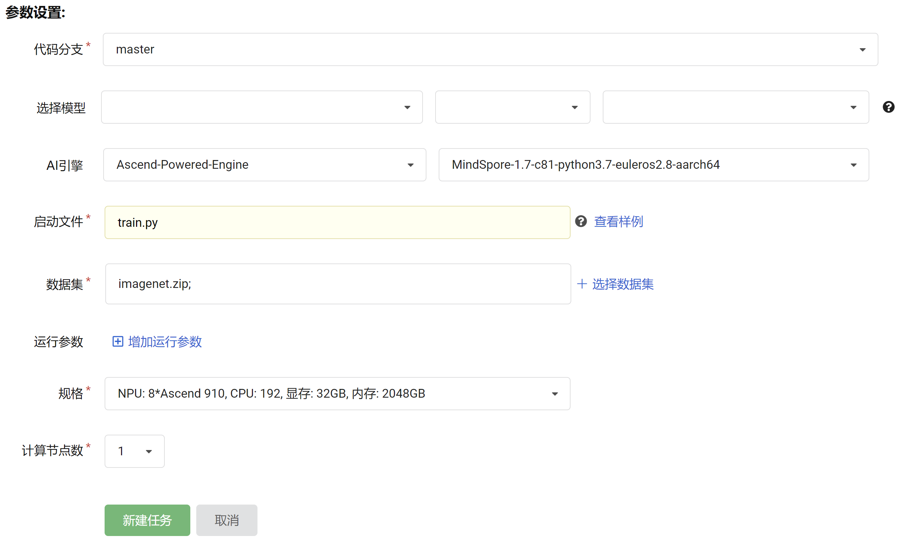
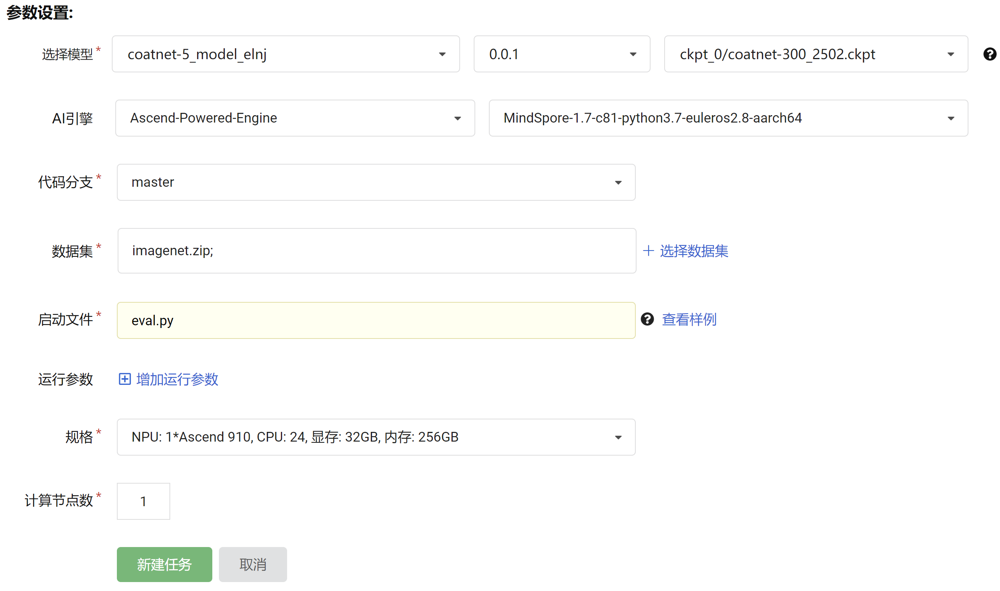
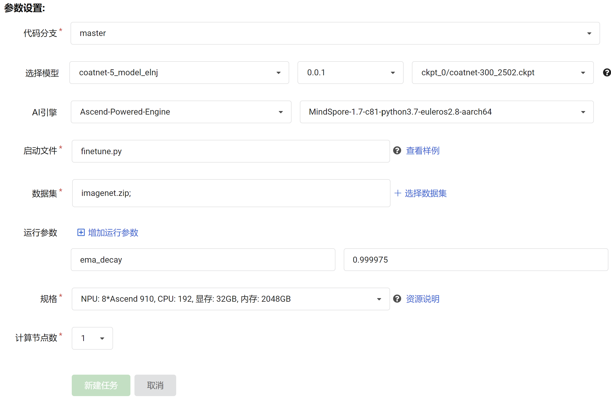
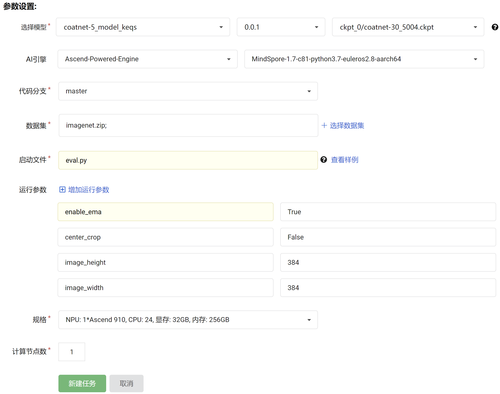

# 目录

<!-- TOC -->

- [目录](#目录)
- [CoAtNet描述](#CoAtNet描述)
- [数据集](#数据集)
- [特性](#特性)
    - [混合精度](#混合精度)
- [环境要求](#环境要求)
- [代码说明](#代码说明)
    - [代码列表](#代码列表)
    - [训练超参数](#训练超参数)
- [训练、微调和测试](#训练、微调和测试)
    - [预训练](#预训练)
        - [测试预训练模型](#测试预训练模型)
    - [微调](#微调)
        - [测试微调模型](#测试微调模型)
- [模型描述](#模型描述)
    - [性能](#性能)
        - [评估性能](#评估性能)
            <!-- - [ImageNet-1k上的CoAtNet](#ImageNet-1k上的CoAtNet) -->
        <!-- - [推理性能](#推理性能)
            - [ImageNet-1k上的CoAtNet](#imagenet-1k上的CoAtNet) -->
<!-- - [ModelZoo主页](#modelzoo主页) -->

<!-- /TOC -->

# [CoAtNet描述](#目录)

Transformers 在计算机视觉方面引人注目，但它们仍然落后于最先进的卷积网络。这项工作表明 Transformer 往往具有更大的模型容量，但由于缺乏正确的归纳偏差，它们的泛化可能比卷积网络更差。
为了有效地结合两种架构的优势，Google Research, Brain Team 提出了 CoAtNets，一种混合模型。它源于两个关键的见解：
（1）逐通道卷积和自注意力可以通过简单的相对注意力自然地统一起来；
（2）垂直堆叠卷积层和注意力层，可以有效地提高模型的泛化性、表达能力和效率


# [数据集](#目录)

使用的数据集：[ImageNet2012](http://www.image-net.org/)

- 数据集大小：共 1,000 类
    - 训练集：共 1,281,167 张图像
    - 测试集：共 50,000 张图像
- 数据格式：JPEG
    - 注：数据在 dataset.py 中处理。
- 下载数据集，目录结构如下：

 ```bash
└─imagenet
    ├─train                         # 训练数据集
    └─val                           # 评估数据集
```

# [特性](#目录)

## 混合精度

采用[混合精度](https://www.mindspore.cn/tutorials/zh-CN/master/advanced/mixed_precision.html)的训练方法，使用支持单精度和半精度数据来提高深度学习神经网络的训练速度，同时保持单精度训练所能达到的网络精度。混合精度训练提高计算速度、减少内存使用的同时，支持在特定硬件上训练更大的模型或实现更大批次的训练。

# [环境要求](#目录)

- 硬件（Ascend）
    - 使用 Ascend 来搭建硬件环境。
- 框架
    - [MindSpore](https://www.mindspore.cn/install/en)
- 如需查看详情，请参见如下资源：
    - [MindSpore教程](https://www.mindspore.cn/tutorials/zh-CN/master/index.html)
    - [MindSpore Python API](https://www.mindspore.cn/docs/api/zh-CN/master/index.html)

# [代码说明](#目录)

## 代码列表

```bash
CoAtNet
├── src
│   ├── model_utils                # 训练环境相关处理
│   │   ├── config.py              # 配置文件处理
│   │   ├── device_adapter.py      # 自动选取 ModelArts 或本地训练相关处理
│   │   ├── __init__.py
│   │   ├── local_adapter.py       # 本地训练相关处理
│   │   └── moxing_adapter.py      # ModelArts 训练相关处理
│   ├── callbacks.py               # 监测训练信息
│   ├── cell_wrapper.py            # 自定义混合精度训练
│   ├── coatnet.py                 # 模型定义
│   ├── dataset.py                 # 数据集读取
│   ├── metrics.py                 # 计算评估指标
│   ├── rand_augment.py            # RandAugment 数据增强
│   └── utils.py                   # 学习率、模型载入等工具
├── default_config.yaml            # 配置文件
├── eval.py                        # 评估程序
├── finetune.py                    # 微调程序
├── LICENSE
├── README.md                      # CoAtNet 相关说明
└── train.py                       # 训练程序
```

## 训练超参数

在 default_config.yaml 中可以配置训练，微调和评估参数。

配置 CoAtNet 和 ImageNet-1k 数据集。

### 训练阶段主要参数
  ```yaml
    # === 数据集设置 ===
    num_classes: 1000                # 数据集分类数目
    image_height: 224                # 输入图片高度
    image_width: 224                 # 输入图片宽度
    center_crop: True                # 启用 center crop
    num_parallel_workers: 16         # 数据处理并行数
    batch_size: 64                   # 每个 device 上的 batch 大小 (16 卡时为 32)

    rand_augment_num_layers: 2       # RandAugment 操作的算子数量
    rand_augment_magnitude: 15       # RandAugment 操作的增强强度
    mixup_alpha: 0.8                 # MixUp 中 β 分布的参数

    # === 网络训练设置 ===
    num_epochs: 300                  # 训练轮数
    lr_max: 0.001                    # 最大学习率
    lr_min: 0.00001                  # 最小学习率
    lr_warmup_epochs: 20             # 学习率热身轮数
    epsilon: 0.000001                # AdamWeightDecay 优化器参数
    weight_decay: 0.05               # AdamWeightDecay 优化器参数
    enable_ema: False                # 不启用 Exponential Moving Average (EMA)
    ema_decay: 0.9999                # EMA 参数
    enable_clip_norm: True           # 启用梯度模长限制
    gradient_norm: 1.0               # 梯度模长参数
    label_smoothing: 0.1             # 标签平滑参数
  ```

### 微调阶段主要参数（参数变更已在 finetune.py 中设置）
  ```yaml
    # === 数据集设置 ===
    num_classes: 1000                # 数据集分类数目
    image_height: 384                # 输入图片高度
    image_width: 384                 # 输入图片宽度
    center_crop: False               # 不启用 center crop
    num_parallel_workers: 16         # 数据处理并行数
    batch_size: 16                   # 每个 device 上的 batch 大小

    rand_augment_num_layers: 2       # RandAugment 操作的算子数量
    rand_augment_magnitude: 15       # RandAugment 操作的增强强度
    mixup_alpha: 0.8                 # MixUp 中 β 分布的参数

    # === 网络训练设置 ===
    num_epochs: 30                   # 训练轮数
    lr_max: 0.00005                  # 最大学习率
    lr_min: 0.00005                  # 最小学习率
    lr_warmup_epochs: 0              # 学习率热身轮数
    epsilon: 0.000001                # AdamWeightDecay 优化器参数
    weight_decay: 0.00000001         # AdamWeightDecay 优化器参数
    enable_ema: True                 # 启用 Exponential Moving Average (EMA)
    ema_decay: 0.999975              # EMA 参数 (16 卡时为 0.99995)
    enable_clip_norm: True           # 启用梯度模长限制
    gradient_norm: 1.0               # 梯度模长参数
    label_smoothing: 0.1             # 标签平滑参数
  ```


更多配置细节请参考配置文件 default_config.yaml。在启智集群上可以按照如下步骤进行训练、微调和评估：

# [训练、微调和测试](#目录)

## 预训练

## 测试预训练模型

## 微调

## 测试微调模型


# [模型描述](#目录)

## 性能

### 评估性能

<!-- #### ImageNet-1k上的CoAtNet -->

<!-- | 参数 | Ascend 910 |
| -------------------------- | ----------------------------------------------------------- |
| 模型 | CoAtNet |
| 模型版本| CoAtNet-1 |
| 资源 | Ascend 910 |
| 上传日期 | 2022-11-03 |
| MindSpore版本 | 1.6.1 |
| 数据集 | ImageNet-1k Train，共1,281,167张图像 |
| 训练参数 | epoch=300, batch_size=32|
| 优化器 | AdamWeightDecay |
| 损失函数 | SoftmaxCrossEntropyWithLogits |
| 损失 | 2.98 |
| 输出 | 概率 |
| 分类准确率 | 16卡：top1:85.206% top5:97.544% |
| 速度 | 16卡：191.8毫秒/步 |
| 训练耗时 | 59h10min21s 启智集群 | -->
<table>
<thead>
  <tr>
    <th>参数</th>
    <th colspan="2">Ascend</th>
  </tr>
</thead>
<tbody>
  <tr>
    <td>模型</td>
    <td colspan="2">CoAtNet</td>
  </tr>
  <tr>
    <td>上传日期</td>
    <td colspan="2">2022-11-03</td>
  </tr>
  <tr>
    <td>MindSpore 版本</td>
    <td colspan="2">1.6.1</td>
  </tr>
  <tr>
    <td>数据集</td>
    <td colspan="2">ImageNet-1k train / val，共 1,281,167 / 50,000 张图像, 共 1,000 类别</td>
  </tr>
  <tr>
    <td>训练参数</td>
    <td colspan="2">num_epochs=300, lr_warmup_epochs=20, batch_size=32 (训练), batch_size=16 (微调)</td>
  </tr>
  <tr>
    <td>优化器</td>
    <td colspan="2">AdamWeightDecay</td>
  </tr>
  <tr>
    <td>损失函数</td>
    <td colspan="2">SoftmaxCrossEntropyWithLogits</td>
  </tr>
  <tr>
    <td>模型版本</td>
    <td>CoAtNet-1</td>
    <td>CoAtNet-2</td>
  </tr>
  <tr>
    <td>损失</td>
    <td>16卡 2.98<br>8卡 2.81</td>
    <td>16卡 2.82</td>
  </tr>
  <tr>
    <td rowspan="3">分类准确率<br></td>
    <td>论文 训练 Top1 Acc: 83.3%<br>论文 微调 Top1 Acc: 85.1%</td>
    <td>论文 训练 Top1 Acc: 84.1%<br>论文 微调 Top1 Acc: 85.7%</td>
  </tr>
  <tr>
    <td>16卡 训练 Top1 Acc: 83.276% Top5 Acc: 96.656%<br>16卡 微调 Top1 Acc: 85.206% Top5 Acc: 97.544%</td>
    <td>16卡 训练 Top1 Acc: 84.060% Top5 Acc: 96.956%<br>16卡 微调 Top1 Acc: 85.804% Top5 Acc: 97.656%</td>
  </tr>
  <tr>
    <td>8卡 训练 Top1 Acc: 83.192% Top5 Acc: 96.628%<br>8卡 微调 Top1 Acc: 85.150% Top5 Acc: 97.502%</td>
    <td></td>
  </tr>
  <tr>
    <td rowspan="2">速度</td>
    <td>16卡 训练 191.8 毫秒每步 <br>16卡 微调 404.0 毫秒每步</td>
    <td>16卡 训练 259.9 毫秒每步<br>16卡 微调 536.7 毫秒每步</td>
  </tr>
  <tr>
    <td>8卡 训练 331.3 毫秒每步 (batch_size=64)<br>8卡 微调 401.6 毫秒每步</td>
    <td></td>
  </tr>
  <tr>
    <td rowspan="2">训练耗时 （启智集群）</td>
    <td>16卡 训练 41:12:19<br>16卡 微调 17:58:02</td>
    <td>16卡 训练 55:36:53<br>16卡 微调 23:31:04</td>
  </tr>
  <tr>
    <td>8卡 训练 70:41:29<br>8卡 微调 34:30:20</td>
    <td></td>
  </tr>
</tbody>
</table>

<!-- # ModelZoo主页

请浏览官网[主页](https://gitee.com/mindspore/models) -->
